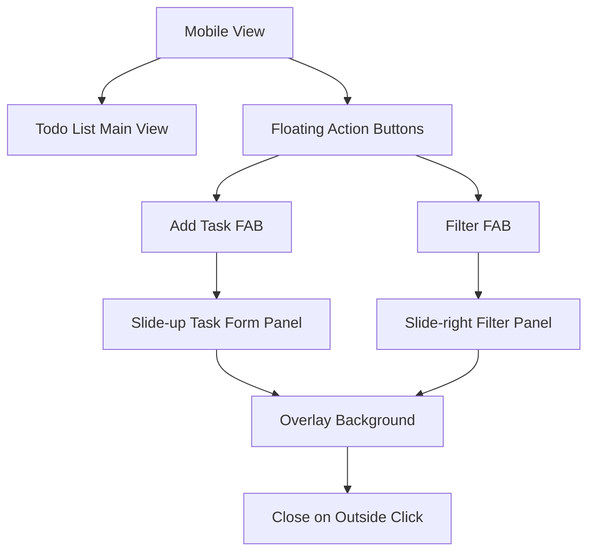

# NovaTask Responsive Design Implementation Plan

## Executive Summary

This document outlines a comprehensive plan to transform NovaTask from a fixed three-column desktop layout into a fully responsive application that maintains its glass morphism aesthetic while providing an optimal experience across all device sizes. The implementation will prioritize a hybrid mobile approach with the Todo List as the main view and slide-over panels for Task Form and Filters.

## 1. Current Issues Analysis

### 1.1 Critical Responsive Problems Identified

1. **Fixed Three-Column Layout**: The current layout uses fixed width sidebars (`w-80`) with a flexible center column, causing horizontal scrolling on devices smaller than ~1024px
2. **No Responsive Breakpoints**: No media queries or responsive utilities implemented
3. **Fixed Font Sizes**: Text doesn't scale appropriately for different viewport sizes
4. **Touch Interaction Issues**: Small touch targets (5x5 checkboxes, 4x4 icon buttons) are difficult to interact with on mobile
5. **No Mobile Navigation Strategy**: Current hide/show buttons are not mobile-friendly
6. **Inefficient Space Usage**: Sidebars consume too much screen real estate on mobile devices

### 1.2 Current Layout Structure

```
Desktop (≥1024px):
┌─────────────────────────────────────────────────────────┐
│ Header (NovaLogo + TodoStats)                           │
├─────────┬───────────────┬─────────────────────────────┤
│ Task    │ Todo List     │ Filters                     │
│ Form    │ (flex-1)      │                             │
│ (w-80)  │               │ (w-80)                      │
└─────────┴───────────────┴─────────────────────────────┘
```

## 2. Responsive Design Strategy

### 2.1 Breakpoint Strategy

Based on Tailwind's default breakpoints and the application's requirements:

```css
/* Mobile First Approach */
sm: 640px   /* Large phones */
md: 768px   /* Tablets */
lg: 1024px  /* Small desktops */
xl: 1280px  /* Desktops */
2xl: 1536px /* Large desktops */
```

### 2.2 Layout Transformation Approach

#### Mobile (< 768px)
- **Primary View**: Todo List takes full width
- **Navigation**: Floating Action Buttons (FABs) for Task Form and Filters
- **Panels**: Slide-over overlays from bottom for Task Form and right for Filters
- **Header**: Simplified with centered logo and collapsed stats

#### Tablet (768px - 1023px)
- **Layout**: Two-column layout with Task Form above Todo List
- **Filters**: Slide-over panel or collapsible section
- **Navigation**: Combination of inline and overlay elements

#### Desktop (≥ 1024px)
- **Layout**: Current three-column layout with enhanced responsive behaviors
- **Enhancements**: Improved hover states, better spacing, optional sidebar collapsing

### 2.3 Mobile Navigation Pattern

#### Hybrid Approach Implementation



## 3. Component-Specific Improvements

### 3.1 NovaLogo Component

#### Current Issues:
- Fixed size logo (48x48) doesn't scale
- Text size may be too large for mobile headers

#### Responsive Improvements:
```tsx
// Logo sizing
width="32" height="32" className="sm:w-40 sm:h-40 md:w-48 md:h-48"

// Text sizing
<h1 className="text-2xl sm:text-3xl font-bold gradient-text">
<p className="text-xs sm:text-sm text-purple-200">
```

#### Enhanced Mobile Interactions:
- Add subtle pulse animation to logo on mobile
- Implement touch-friendly logo as home button
- Add haptic feedback simulation with visual feedback

### 3.2 TodoForm Component

#### Current Issues:
- Fixed width inputs (`max-w-md`, `max-w-xs`)
- Grid layout doesn't optimize for mobile
- Button size may be too small for comfortable tapping

#### Responsive Improvements:
```tsx
// Form container
<div className="backdrop-blur-md bg-white/10 rounded-2xl border border-white/20 p-4 sm:p-6 shadow-2xl">

// Input fields
<input className="w-full px-4 py-3 sm:py-4 text-base sm:text-lg min-h-[44px] sm:min-h-[48px]" />

// Grid layout
<div className="grid grid-cols-1 sm:grid-cols-2 gap-3 sm:gap-4">

// Submit button
<button className="w-full py-4 sm:py-3 text-base sm:text-lg font-semibold min-h-[48px]">
```

#### Mobile Panel Implementation:
```tsx
// Slide-up panel for mobile
<div className={`
  fixed inset-x-0 bottom-0 z-50 transform transition-transform duration-300 ease-in-out
  ${isOpen ? 'translate-y-0' : 'translate-y-full'}
  sm:relative sm:translate-y-0 sm:inset-auto
`}>
```

### 3.3 TodoList Component

#### Current Issues:
- Small touch targets (5x5 checkboxes, 4x4 icon buttons)
- Metadata layout may be cramped on mobile
- Edit mode buttons are too small for touch

#### Responsive Improvements:
```tsx
// Checkbox sizing
<button className="w-6 h-6 sm:w-5 sm:h-5 rounded-full border-2">

// Action buttons
<button className="p-3 sm:p-2 text-purple-300 hover:text-white">
  <svg className="w-5 h-5 sm:w-4 sm:h-4" />

// Metadata layout
<div className="flex flex-wrap gap-2 sm:gap-4 mt-2 text-xs sm:text-sm">

// Todo item spacing
<div className="p-3 sm:p-4">
```

#### Enhanced Mobile Interactions:
- Swipe-to-delete functionality
- Pull-to-refresh for data synchronization
- Touch-friendly drag to reorder
- Haptic feedback simulation with visual responses

### 3.4 TodoFilters Component

#### Current Issues:
- Fixed width doesn't adapt to mobile
- Select dropdowns may be difficult to use on mobile

#### Responsive Improvements:
```tsx
// Filter container
<div className="backdrop-blur-md bg-white/10 rounded-2xl border border-white/20 p-4 sm:p-6">

// Select elements
<select className="w-full px-4 py-3 sm:py-4 text-base min-h-[44px]">
```

#### Mobile Panel Implementation:
```tsx
// Slide-right panel for mobile
<div className={`
  fixed inset-y-0 right-0 z-50 w-80 sm:w-96 max-w-[85vw] transform transition-transform duration-300 ease-in-out
  ${isOpen ? 'translate-x-0' : 'translate-x-full'}
  sm:relative sm:translate-x-0 sm:inset-auto sm:w-full
`}>
```

### 3.5 TodoStats Component

#### Current Issues:
- Fixed layout may overflow on small screens
- Text sizes don't adapt to viewport

#### Responsive Improvements:
```tsx
// Container
<div className="flex gap-2 sm:gap-4 text-white overflow-x-auto">

// Individual stats
<div className="min-w-fit text-center">
  <div className="text-lg sm:text-2xl font-bold">
  <div className="text-xs sm:text-xs">
</div>
```

#### Mobile Header Integration:
- Collapse into dropdown menu on mobile
- Show only key metrics (total and completion rate)
- Implement expandable stats section

## 4. CSS Architecture Improvements

### 4.1 Enhanced Tailwind v4 Setup

#### Custom Theme Configuration:
```css
@theme inline {
  /* Enhanced color palette */
  --color-glass-bg: rgba(255, 255, 255, 0.1);
  --color-glass-border: rgba(255, 255, 255, 0.2);
  --color-glass-hover: rgba(255, 255, 255, 0.15);
  
  /* Responsive spacing scale */
  --spacing-safe-top: env(safe-area-inset-top);
  --spacing-safe-bottom: env(safe-area-inset-bottom);
  
  /* Touch-friendly sizing */
  --size-touch-target: 44px;
  --size-touch-target-large: 48px;
}
```

#### Custom Utility Classes:
```css
/* Glass morphism variants */
.glass-mobile {
  backdrop-filter: blur(12px) saturate(150%);
  background-color: rgba(255, 255, 255, 0.08);
  border: 1px solid rgba(255, 255, 255, 0.15);
}

.glass-desktop {
  backdrop-filter: blur(16px) saturate(180%);
  background-color: rgba(255, 255, 255, 0.1);
  border: 1px solid rgba(255, 255, 255, 0.2);
}

/* Touch-friendly utilities */
.touch-target {
  min-height: var(--size-touch-target);
  min-width: var(--size-touch-target);
}

.touch-target-large {
  min-height: var(--size-touch-target-large);
  min-width: var(--size-touch-target-large);
}

/* Safe area utilities */
.safe-top {
  padding-top: var(--spacing-safe-top);
}

.safe-bottom {
  padding-bottom: var(--spacing-safe-bottom);
}

/* Responsive animations */
.animate-slide-up {
  animation: slide-up 0.3s ease-out;
}

.animate-slide-right {
  animation: slide-right 0.3s ease-out;
}

@keyframes slide-up {
  from { transform: translateY(100%); opacity: 0; }
  to { transform: translateY(0); opacity: 1; }
}

@keyframes slide-right {
  from { transform: translateX(100%); opacity: 0; }
  to { transform: translateX(0); opacity: 1; }
}
```

### 4.2 Animation and Transition Considerations

#### Mobile-Optimized Animations:
```css
/* Reduced motion for performance */
@media (prefers-reduced-motion: reduce) {
  .animate-slide-up,
  .animate-slide-right,
  .animate-float {
    animation: none;
  }
}

/* Hardware acceleration */
.mobile-panel {
  transform: translateZ(0);
  will-change: transform;
}

/* Touch feedback */
.touch-feedback {
  transition: transform 0.1s ease-out, background-color 0.1s ease-out;
}

.touch-feedback:active {
  transform: scale(0.95);
  background-color: rgba(255, 255, 255, 0.2);
}
```

## 5. Implementation Priority

### 5.1 Phase 1: Core Responsive Structure (Week 1)
1. **Breakpoint Implementation**
   - Add responsive utilities to main layout
   - Implement mobile-first approach in page.tsx
   - Create basic mobile navigation structure

2. **Component Adaptation**
   - Update NovaLogo with responsive sizing
   - Implement responsive TodoList with touch-friendly targets
   - Create basic mobile panels for TodoForm and TodoFilters

### 5.2 Phase 2: Enhanced Mobile Experience (Week 2)
1. **Mobile Navigation**
   - Implement slide-over panels with proper animations
   - Add floating action buttons
   - Create overlay backgrounds with proper touch handling

2. **Component Refinement**
   - Enhance TodoForm for mobile use
   - Improve TodoFilters mobile experience
   - Optimize TodoStats for mobile header

### 5.3 Phase 3: Advanced Features (Week 3)
1. **Micro-interactions**
   - Add touch feedback animations
   - Implement swipe gestures
   - Create haptic feedback simulation

2. **Performance Optimization**
   - Optimize animations for mobile devices
   - Implement lazy loading for heavy components
   - Add loading states and skeleton screens

### 5.4 Phase 4: Polish and Testing (Week 4)
1. **Cross-Device Testing**
   - Test on various screen sizes
   - Verify touch interactions
   - Performance profiling

2. **Accessibility Enhancement**
   - Ensure keyboard navigation works
   - Add proper ARIA labels
   - Test with screen readers

## 6. Additional Enhancements

### 6.1 Loading States

#### Skeleton Screens:
```tsx
// Todo item skeleton
<div className="backdrop-blur-md bg-white/10 rounded-xl p-4 animate-pulse">
  <div className="flex items-start gap-3">
    <div className="w-5 h-5 rounded-full bg-white/20"></div>
    <div className="flex-1">
      <div className="h-4 bg-white/20 rounded w-3/4 mb-2"></div>
      <div className="h-3 bg-white/20 rounded w-1/2"></div>
    </div>
  </div>
</div>
```

#### Loading Indicators:
```css
/* Glass morphism loading spinner */
.loading-spinner {
  width: 40px;
  height: 40px;
  border: 3px solid rgba(255, 255, 255, 0.2);
  border-top-color: rgba(168, 85, 247, 0.8);
  border-radius: 50%;
  animation: spin 1s linear infinite;
}
```

### 6.2 Error State Styling

```tsx
// Error boundary component
<div className="backdrop-blur-md bg-red-500/10 border border-red-500/30 rounded-2xl p-6">
  <div className="text-center">
    <div className="text-4xl mb-4">⚠️</div>
    <h3 className="text-xl font-semibold text-red-300 mb-2">Something went wrong</h3>
    <p className="text-red-200">{error.message}</p>
  </div>
</div>
```

### 6.3 Accessibility Improvements

#### Focus Management:
```css
/* Enhanced focus indicators */
.focus-visible:focus {
  outline: 2px solid rgba(168, 85, 247, 0.8);
  outline-offset: 2px;
}

/* Skip links for mobile */
.skip-link {
  position: absolute;
  top: -40px;
  left: 6px;
  background: rgba(168, 85, 247, 0.9);
  color: white;
  padding: 8px;
  text-decoration: none;
  z-index: 100;
}

.skip-link:focus {
  top: 6px;
}
```

#### Screen Reader Support:
```tsx
// ARIA labels for mobile panels
<div
  role="dialog"
  aria-modal="true"
  aria-labelledby="panel-title"
  className="fixed inset-y-0 right-0 z-50"
>
  <h2 id="panel-title" className="sr-only">Task Filters</h2>
  {/* Panel content */}
</div>
```

### 6.4 Performance Considerations

#### Optimization Strategies:
1. **Conditional Rendering**: Only render mobile panels when needed
2. **Animation Performance**: Use CSS transforms instead of layout properties
3. **Image Optimization**: Compress and serve appropriately sized images
4. **Code Splitting**: Lazy load non-critical components
5. **Touch Event Optimization**: Use passive event listeners where possible

#### Monitoring:
```tsx
// Performance monitoring for mobile
useEffect(() => {
  if ('performance' in window && 'measure' in window.performance) {
    // Measure panel open/close performance
    performance.mark('panel-open-start');
    // Panel opens...
    performance.mark('panel-open-end');
    performance.measure('panel-open', 'panel-open-start', 'panel-open-end');
  }
}, [isOpen]);
```

## 7. Implementation Guidelines

### 7.1 Development Workflow

1. **Mobile-First Development**: Start with mobile styles, then enhance for larger screens
2. **Component Isolation**: Test each component's responsive behavior independently
3. **Progressive Enhancement**: Ensure core functionality works without JavaScript
4. **Cross-Browser Testing**: Test on Safari, Chrome, Firefox on both iOS and Android

### 7.2 Testing Strategy

1. **Device Testing**: Test on actual devices, not just emulators
2. **Touch Testing**: Verify all touch targets are at least 44x44px
3. **Orientation Testing**: Test both portrait and landscape modes
4. **Performance Testing**: Monitor animation frame rates and interaction latency

### 7.3 Code Organization

```
src/
├── components/
│   ├── responsive/
│   │   ├── MobilePanel.tsx
│   │   ├── FloatingActionButton.tsx
│   │   └── ResponsiveLayout.tsx
│   ├── ui/
│   │   ├── TouchTarget.tsx
│   │   └── GlassContainer.tsx
├── hooks/
│   ├── useResponsive.ts
│   ├── useTouchGestures.ts
│   └── usePanelState.ts
└── utils/
    ├── responsive.ts
    └── animations.ts
```

## 8. Success Metrics

### 8.1 Technical Metrics
- [ ] Lighthouse mobile score ≥ 90
- [ ] First Contentful Paint < 1.5s
- [ ] Time to Interactive < 3s
- [ ] Cumulative Layout Shift < 0.1

### 8.2 User Experience Metrics
- [ ] All touch targets ≥ 44x44px
- [ ] No horizontal scrolling on any device
- [ ] Text remains readable at all viewport sizes
- [ ] Smooth animations (60fps) on mobile devices

### 8.3 Accessibility Metrics
- [ ] WCAG 2.1 AA compliance
- [ ] Keyboard navigation works on all components
- [ ] Screen reader compatibility verified
- [ ] Sufficient color contrast maintained

## Conclusion

This comprehensive plan addresses all identified responsive issues while enhancing the glass morphism aesthetic with additional micro-interactions and animations for mobile devices. The implementation prioritizes a hybrid approach with the Todo List as the main view and slide-over panels for Task Form and Filters, providing an optimal experience across all device sizes.

The phased implementation approach ensures a systematic transformation of the application while maintaining functionality and performance standards. Regular testing and optimization throughout the process will guarantee a high-quality, responsive NovaTask application that delights users on any device.